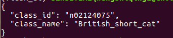
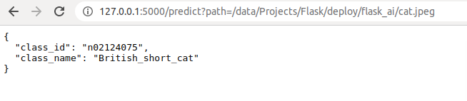

# flask_ai
> Deploy CV models based on Flask Framework

下载本项目的小伙伴，别忘了给我个star，谢谢！

1、下载项目代码
> https://github.com/wsqat/flask_ai.git

```
$ git clone https://github.com/wsqat/flask_ai.git
```


2、虚拟环境安装
> 前置条件 Anaconda 安装成功

```
cd flask_ai

# 配置虚拟环境
conda create -n flask_ai python=3.7

# 激活虚拟环境
conda activate flask_ai

# 下载依赖
pip install -r requirements.txt
```

3、运行代码

主要包括 服务端 和  客户端

> 服务端接收请求情况

```
FLASK_ENV=development FLASK_APP=app.py flask run
```


> 其他主机向远程主机传递图片并获得预测结果

```
curl -X POST -F file=@cat.jpeg http://127.0.0.1:5000/predict
```


> 从浏览器发出请求，图片在服务端本地

```
http://127.0.0.1:5000/predict?path=/data/Projects/Flask/deploy/flask_ai/cat.jpeg
```



### 报错 Q1、
> ImportError: libcudart.so.9.0: cannot open shared object file: No such file or directory

解决方案：https://blog.csdn.net/mumoDM/article/details/79502848
大部分情况下是环境没有配好，以下是第一种可靠的解决方法：

```
cd ~
sudo vi .bashrc
// 下滑到文件末，添加以下内容
export PATH=$PATH:/usr/local/cuda/bin
export LD_LIBRARY_PATH=$LD_LIBRARY_PATH:/usr/local/cuda/lib64
export LIBRARY_PATH=$LIBRARY_PATH:/usr/local/cuda/lib64
// 刷新.bashrc
source .bashrc
// 以上解法是对生成了软连接的情况；如果没有生成软连接，则把以上的cuda改为cuda-9.0
```

如果添加好了环境，还是出现同样的报错，则可以尝试以下解法：
```
cd ~
sudo cp /usr/local/cuda-9.0/lib64/libcudart.so.9.0 /usr/local/lib/libcudart.so.9.0 && sudo ldconfig
sudo cp /usr/local/cuda-9.0/lib64/libcublas.so.9.0 /usr/local/lib/libcublas.so.9.0 && sudo ldconfig
sudo cp /usr/local/cuda-9.0/lib64/libcurand.so.9.0 /usr/local/lib/libcurand.so.9.0 && sudo ldconfig

```
